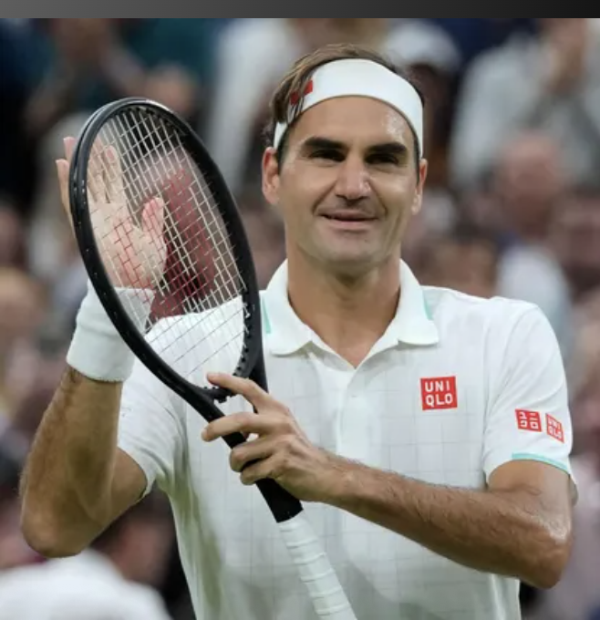
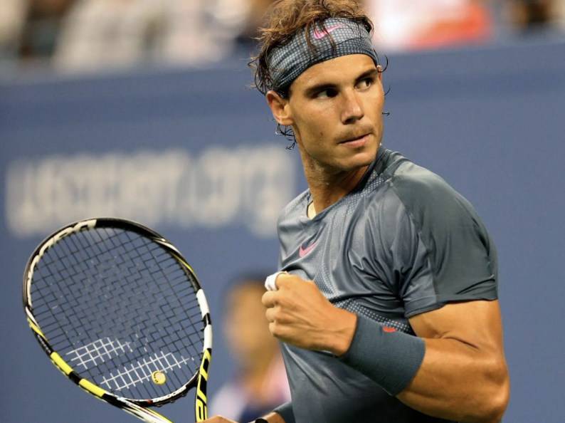
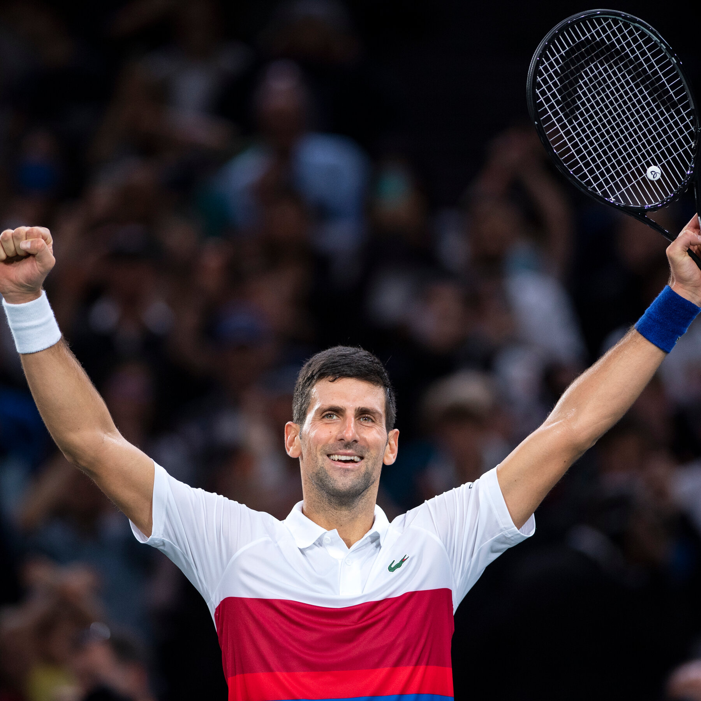
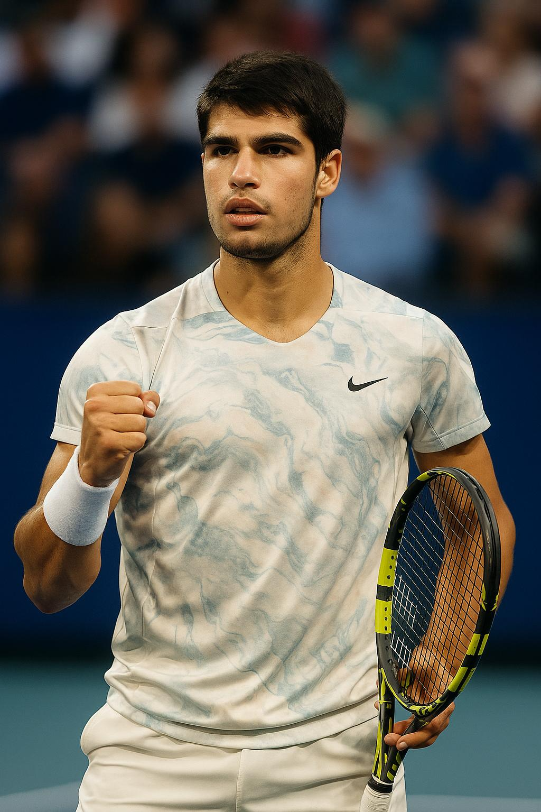
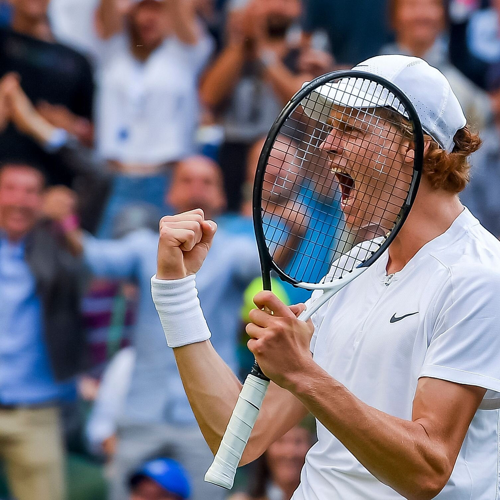

Professional tennis has given us legends, created fierce rivalries, and given us unforgettable matches. This site uses data visualizations to bring such stories to life, and to highlight patterns, rivalries, and the evolution of the sport.

At the center of modern tennis history stands Roger Federer, Rafael Nadal, and Novak Djokovic, also known as the Big Three. Their rivalry has defined an era, producing countless wins, each pushing each each other to new heights. Together, they’ve amassed dozens of Grand Slam titles, spent record-breaking weeks at World No. 1, and redefined what dominance looks like in tennis.

Now that two of the Big Three players have retired, a new rivalry has began to take stage. Carlos Alcaraz and Jannik Sinner are not just rising stars, they’re the future of the sport. With data-driven insights, we’ll explore how their early careers compare to the Big Three, and what their budding rivalry might mean for the future of tennis.

Our data stretches back over six decades and includes every player since 1963: their names, heights, countries of origin, and every match detail from the ATP tour. By combining rich historical records with modern performance metrics, this project offers both context and clarity to tennis’s biggest debates.

## Get to know the players:

```{r}

```

**Roger Federer** Roger Federer is a Swiss tennis player, born in 1981 in Basel. He became one of the sport’s greatest champions with 20 Grand Slam titles, highlighted by a record 8 at Wimbledon. He held the world No. 1 ranking for 310 weeks, earned two Olympic medals, and retired in 2022 after more than two decades at the top of the game.

<br clear="all">

```{r}

```

**Rafael Nadal** Rafael Nadal is a Spanish tennis legend, born in 1986 in Manacor, Mallorca. He turned pro in 2001, and over his career amassed 22 Grand Slam singles titles, including a record 14 at the French Open. He has 92 ATP singles titles in total, spent 209 weeks as world No. 1, and dominated on the clay courts before retiring in 2024.

<br clear="all">

```{r}

```

**Novak Djokovic** Novak Djokovic is a Serbian tennis player, born in 1987 in Belgrade. Novak has won a record 24 Grand Slam titles, including 10 Australian Opens. He has held the world No. 1 ranking for a record 428 weeks, and has established himself as one of the most accomplished and dominant players in tennis history.

<br clear="all">

```{r}

```

**Carlos Alcarz** Carlos Alcaraz is a Spanish tennis player, born in 2003 in El Palmar, Murcia. Carlos turned professional in 2018, and by the age of 22, has already won six Grand Slam singles titles — French Open (2024, 2025), Wimbledon (2023, 2024), and US Open (2022, 2025). He has risen to the world No. 1 ranking, which was first achieved in 2022 and again in 2025.

<br clear="all">

```{r}

```

**Jannik Sinner** Jannik Sinner is an Italian tennis player, born in 2001 in San Candido. Jannik turned pro in 2018, and by the age of 24, has already won 4 Grand Slam singles titles — Australian Open (2024, 2025), US Open (2024), and Wimbledon (2025). He reached the world No. 1 ranking in 2024, and has claimed 24 ATP Tour-level singles titles overall, marking him as one of the top rising stars and most accomplished young players in men’s tennis.

<br clear="all">
