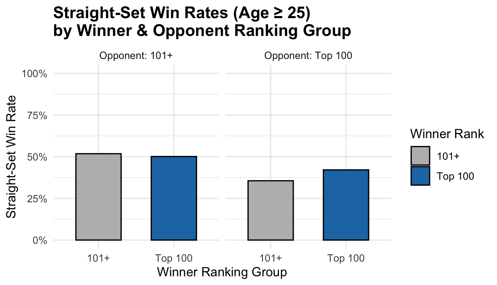

## CODE

rank_rate_facet_plot \<- rates_all %\>% ggplot(aes(x = rank_group, y = straight_set_rate, fill = rank_group)) + geom_col(width = 0.6, color = "black") + facet_wrap(\~ opp_rank_group) + scale_y_continuous(labels = scales::percent, limits = c(0, 1)) + scale_fill_manual(values = c("Top 100" = "#1f78b4", "101+" = "#bbbbbb")) + theme_minimal() + labs( title = "Straight-Set Win Rates (Age ≥ 25)\nby Winner & Opponent Ranking Group", x = "Winner Ranking Group", y = "Straight-Set Win Rate", fill = "Winner Rank" ) + theme( plot.title = element_text(size = 14, face = "bold") )

## 

Hi professor,

Here is my new graph above. I could not find my old code, as we talked about in class, so I redid it all.
